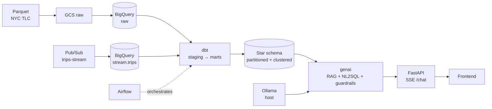

# taxi-chat-data

An end-to-end data-engineering + GenAI project on NYC Taxi data: batch and
streaming ingestion into BigQuery, a dbt star schema on top, and a natural-language
chat interface that answers questions by generating SQL against the warehouse.

Design document: [docs/DESIGN.md](docs/DESIGN.md) · Phase plans: [docs/superpowers/plans/](docs/superpowers/plans/)

## Architecture



## Quickstart

**Prerequisites**

- Python 3.14 and Docker
- [Ollama](https://ollama.com) on the host with `gemma4`, `llama3.1:8b`, `nomic-embed-text`
- `gcloud auth application-default login` (the project uses ADC — never key files)

**Setup**

```bash
python3 -m venv .venv && source .venv/bin/activate
pip install -r requirements.txt
cp .env.example .env    # fill in GCP_PROJECT_ID and GCS_BUCKET
```

**Run**

```bash
docker compose --profile api up          # API + docs on http://localhost:8000/docs
docker compose --profile airflow up -d   # Airflow UI on http://localhost:8080
docker compose --profile dbt run --rm dbt build
```

Compose is the one-command path for trying the project out. The virtualenv from
the setup step is what you want for development — running the test suite, the
ingestion scripts (`python -m ingestion.batch_load`) and the evaluation
(`python -m genai.eval`), or serving the API with reload via
`uvicorn api.main:app --reload`.

Ollama stays on the host on purpose: a container on macOS gets no GPU access and
would re-download ~10 GB of models. Containers reach it via `host.docker.internal`.

Airflow creates DAGs paused by default — before triggering `dbt_transform` for
the first time, run `airflow dags unpause dbt_transform` (or unpause it in the
UI), otherwise scheduling silently does nothing.

For the frontend dev server, see [frontend/](frontend/) — it runs on `:3002`.

## What this demonstrates

| Requirement | Where in the project |
|---|---|
| Batch + streaming pipeline | [ingestion/batch_load.py](ingestion/batch_load.py), [ingestion/stream_producer.py](ingestion/stream_producer.py), [ingestion/stream_consumer.py](ingestion/stream_consumer.py) |
| Data lake + warehouse | GCS raw layer + [dbt/models/](dbt/models/) star schema |
| Logical/physical modelling | [dbt/models/marts/](dbt/models/marts/) — dim/fct with partitioning and clustering |
| SQL optimisation in BigQuery | [analysis/measure_partitioning.py](analysis/measure_partitioning.py) — partition/cluster scan measurements |
| LLM / GenAI, chat with data | [genai/](genai/) + [api/main.py](api/main.py) |
| NL2SQL + risk mitigation | [genai/nl2sql.py](genai/nl2sql.py), [genai/guardrails.py](genai/guardrails.py) |
| RAG + vector store | [genai/retriever.py](genai/retriever.py), [genai/indexer.py](genai/indexer.py) (Chroma) |
| GenAI quality evaluation | [genai/eval.py](genai/eval.py), [docs/eval/latest.md](docs/eval/latest.md) |
| Orchestration | [dags/dbt_transform_dag.py](dags/dbt_transform_dag.py) (Airflow) |
| DevSecOps | ADC, [.gitleaks.toml](.gitleaks.toml), [.github/workflows/ci.yml](.github/workflows/ci.yml) |
| Python (advanced) | Whole codebase, [tests/](tests/) |

## Model evaluation

18 natural-language questions with reference SQL, scored on order-insensitive
result-set equality. Numbers from [docs/eval/latest.md](docs/eval/latest.md):

| Model | Accuracy | Executed | Avg attempts | Refusals |
|---|---|---|---|---|
| gemma4:latest | 67% | 94% | 1.44 | 1 |
| llama3.1:8b | 61% | 78% | 1.50 | 4 |

Regenerate with `python -m genai.eval`; the API also serves the latest report at
`GET /eval`.

## DevSecOps

- **Credentials:** Application Default Credentials only. No service-account keys
  exist in the project, and [.gitignore](.gitignore) blocks `*-key.json`,
  `*-sa.json`, `credentials.json` and `.env` so one cannot be added by accident.
- **Secret scanning:** gitleaks runs over the *full* git history on every push
  and PR — a secret that was committed and reverted is still a leak.
- **CI:** four jobs on every push and PR — `lint` (ruff), `test` (pytest), `dbt`
  (`dbt deps` + `dbt parse` — model/YAML validation with no BigQuery connection,
  so CI holds zero cloud credentials), and `secrets` (gitleaks over full history).
- **Cost control:** [genai/guardrails.py](genai/guardrails.py) validates generated
  SQL and runs a BigQuery dry-run to reject queries that would scan too much data.

## Repository layout

| Path | Contents |
|---|---|
| [ingestion/](ingestion/) | Batch loader, Pub/Sub producer and consumer |
| [dbt/](dbt/) | Staging models, star schema, tests |
| [genai/](genai/) | LLM client, RAG retriever, NL2SQL, guardrails, evaluation |
| [api/](api/) | FastAPI app, SSE streaming contract |
| [frontend/](frontend/) | Chat UI |
| [dags/](dags/) | Airflow DAGs |
| [analysis/](analysis/) | Partition/cluster scan-cost measurement |
| [tests/](tests/) | pytest suite |
| [docs/](docs/) | Design, specs, plans, per-phase feature docs |

## Build phases

- [x] Faza 0 — setup: repo, GCP project, `.env`
- [x] Faza 1 — batch ingestion: Parquet → GCS → BigQuery raw
- [x] Faza 2 — warehouse: dbt staging → star schema, partitioning and clustering
- [x] Faza 3 — GenAI: RAG + NL2SQL + guardrails
- [x] Faza 4 — streaming: Pub/Sub producer and consumer
- [x] Faza 5 — FastAPI + frontend
- [x] Faza 6 — evaluation, stream merge, Airflow
- [x] Faza 7 — DevSecOps: CI, secret scanning, unified compose

Per-task detail for phases 3–6 lives in [docs/features/](docs/features/); the
earlier phases are covered by their specs and plans under
[docs/superpowers/](docs/superpowers/).

## Deliberate limitations

- **One month of data.** A small slice keeps the project inside the BigQuery free
  tier. Nothing in the design prevents scaling it up.
- **Neo4j / graph modelling deferred.** Listed as nice-to-have; it would not have
  changed the pipeline's shape.
- **Ollama on the host, not in Compose.** GPU access and a 10 GB model re-download.
- **`dbt test` runs locally and in Airflow, not in CI.** CI holds no GCP
  credentials by design, and `dbt test` requires a live warehouse.
